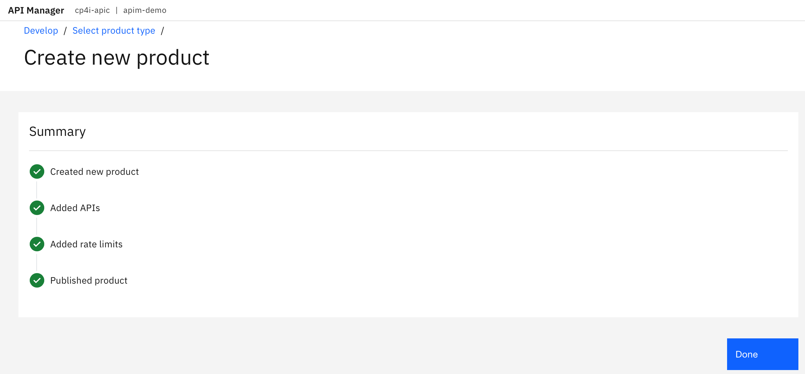

# APIC Dev Jam Lab 1 - Create and Secure an API #

In this lab, you will get a chance to use the online APIC Developer
Toolkit and its intuitive interface to create a new API using the
OpenAPI definition (YAML) of the existing product inventory RESTful
web-service.

In this tutorial, you will explore the following key capabilities:

-   Creating an API by importing an OpenAPI definition for an existing
    REST service.

-   Configuring ClientID/Secret Security, endpoints, and proxy to invoke
    endpoint.

-   Testing a REST API in the online developer toolkit.

-   Publish an API for developers.

## APIC Dev Jam Series

The APIC Dev Jam Series is a hands-on workshop with lab exercises that
walk you through designing, publishing, and securing APIs. This workshop
is for API developers, architects, and line of business people who want
to create a successful API strategy. There are 8 labs and each is 30
minutes long. Make sure you choose enough time in your reservation to
get through all the labs! 

## Import API to the Developer Workspace

First, we will download the OpenApi file for the existing REST service
for Inventory. Then, we will import it to the online workspace.

1.  Open a browser window to the API Manager Portal. If the screen
    displays `Your connection is not private` click Advanced, and then Accept the to continue. Log in with the username ad credentials supplied.
    
    Make sure to select `Techcon LDAP` as the login and not `Common Services User Registry`.

    

    

2.  Click on the `Develop APIs and
    Products` tile
    to enter the online development workspace. If you don't see `Develop APIs and Products` tile you may have logged in using the `Common Services User Registry` and not `Techcon LDAP`. 

      

3.  Now you are in the home screen of the online developer tool. From
    here, you can begin to create APIs and Products.

      

4.  Click `ADD->API.`

      

5.  On the next screen, select `Existing OpenAPI` under
    Import**,** as in the image below. Then
    click   `Next.`

      

6.  Now download the `findbranch.yaml`
    

    Save the file: [findbranch.yaml](../resources/findbranch.yaml) to an easy to find location as you will be uploading the file as part of the Import and Existing OpenAPI.

    Choose the downloaded `findbranch.yaml` OpenAPI definition and Click `Next.`

      

7.  **Do not** select **Activate API** for this lab. If you do check this box API Connect will automatically create a default Product and Plan assicated with this API and then publish it out to the Gateway and Developer portal with a sandbox subscription all in one click. We want to explore these steps as part of the rest of the lab. 
    Click `Next`.

      

8.  The API should be imported successfully as shown in the image below.
    Click `Edit API`.

    

## Configure API

After importing the existing API, the first step is to configure basic
security before exposing it to other developers. By creating a client
id and secret security, you are able to identify the app using the
services for analytics and simple security. Next, we will validate the backend endpoints where the API is
actually running. API Connect supports pointing to multiple backend
endpoints to match your multiple build stage environments. Finally, we
will configure the proxy call to invoke the endpoint.

### Configure API Key security

1. 	Click on the + icon besides the security schema to create a new security schema
    

2.	Put in the name of the schema and select apiKey as the type
    
3.  Put in the name of the key and select “client_id” as the key type and header as the location.  Then click
Create
    

4.  The newly created security schema will be shown in the left navigator.

5.  Click on the + icon besides the security

    

6.	Select the security schema created in the step 3, and then click create and then submit to create it.

    
    

7.  Repeat steps 1 to 4 to create X-IBM-Client-Secret as a Key Type of client_secret,

    

6.	Go to the Security entry created in step 5. Select the security schema created in the step 3, and then click create and then submit to create it.

    

### Review & Validate Target-URL for Sandbox environment

1.  Click on the Gateway tab (1) and then use the open up the Properties settings (2) and click on target-url to create a review our target-url property.
    

2.  The Property Value of `target-url` should contain the URL should be  `https://apictutorials.mybluemix.net/branches`. By setting the URL as a property we can set override values based on which Catalog (e.g. Environment) we are deploying the API but for our purpose we will just set the default property value. You can create as many properties as you would like that can be injected into the Gateway Policies by referencing them as `$(Property_Name)` so in this case `$(target-url)` which we will do in the next step.

    

3.  Click `Save` to complete the
    configuration.

### Configure Proxy Call in Designer

1.  Click on the “Policies” and then click on the “Proxy” item in the assembly panel.
    

2.  Update the URL in the Proxy configuration from `$(target-url)` with  `$(target-url)/branches`. You can see all the other optional configurations you can add to the invoke
    

3.  Click `Save`.

## Test the API

In the API designer, you have the ability to test the API immediately
after creation in the Gateway view!

1.  Toggle `Offline` to activate API. to publish the API itself to the gateway for testing

    

2.  Click on the Test tab and select in the drop down

`GET https://MYHOSTNAMEHERE/sandbox/findbranch/details`

 *Your URL will be different from that in the example.*
 

  

3.  Click `Send`.

4.  In the first time of running the API after publishing the API, the security warning dialog box may show.  Please click on the `here` link and accept the certificate to see the 401 message.
    

5.  Go back to the test view and
    click `Send` again.

6. Now you will see a Response section with Status code 200 OK and the
    Body displaying all the branch information. Take some time to explore the Body, Headers, and Trace tabs in teh Response section.

    

## Publish API

In this lab, we will make the API available to developers. In order to
do so, the API must be first put into a product and then published to
the sandbox catalog. A product dictates rate limits and API throttling.
When the product is published, the Invoke policy defined in the previous
lab is written to the gateway. 

### Create Inventory Product and Add API

1.  From the vertical navigation menu on the left, click `Develop` (pencil icon) to return to the `Develop` home screen.

    

2.  Click `Add` and select `Product`
    

3.  On the next screen, select `New Product`. Then click `Next`.
    
4.  For the Title, enter `Branch APIs`. Click `Next`.
    
    
5.  Select the `FindBranch 1.0.0 API` as shown in the image below. Then click `Next`.  
    
    
6.  Keep the `Default Plan` as is. Click `Next`.  

7.  Under `Publish`, enable `Publish Product` as shown in the image below. Then click `Next`
    

8.  The Product is now published successfully with the API base URL listed and available for developers from the developer portal.
    

## Summary

You completed the APIC Dev Jam Lab 1 - Create and Secure an API. Throughout the tutorial, you explored the key takeaways:

-   Create an API by importing an OpenAPI definition for an existing
    REST service.

-   Configure ClientID/Secret Security, endpoints, and proxy to invoke
    endpoint.

-   Test a REST API in the online developer toolkit.

-   Publish an API for developers.

Continue the APIC Dev Jam! Go to [APIC Dev Jam Lab 2 - The Developer Portal Experience](../Lab2) to learn how to socialise this API and make it available to developers.
