# APIC Dev Jam Lab 2 - The Developer Portal Experienace #

In this lab, we will take the API created in Lab 1 and publish it to a
Developer Portal, ready for consumption by app developers. We will begin
by creating a new catalog and configuring the developer portal for our
Inventory product. We will then define a new plan in the product and
publish to our new developer portal.

In this tutorial, you will explore the following key capabilities:

-   Configure the Developer Portal and publish the APIs.

-   Create a Portal Account.

-   Create App and Subscribe to Plan.

-   Test API in the Developer Portal

## APIC Dev Jam Series

The APIC Dev Jam Series is a hands-on workshop with lab exercises that
walk you through designing, publishing, and securing APIs. This workshop
is for API developers, architects, and line of business people who want
to create a successful API strategy. There are 8 labs and each is 30
minutes long. Make sure you choose enough time in your reservation to
get through all the labs! 

Prerequisites: Labs 1

## Generate the developer portal

Application developers discover and use APIs by using the Developer Portal. You can customize the Developer Portal for your application developers.
In addition to allowing application developers to find and use both free and paid APIs, the Developer Portal provides additional features including forums, blogs, comments, and ratings, together with an administrative interface for customizing the Developer Portal. 

Now that your product is published, let’s view it in the developer portal. This can be found under the Manage section of APIC. 

1\. Click on the **Manage** tab on the left side bar.

![alt text][pic36]

2\. Click the catalog in which you published the API (sandbox).

![alt text][pic37]

3\. Click on **Catalog settings**.

![alt text][pic38]

4\. Click on **Portal** in the left menu and copy and paste the Portal URL into your browser in a new tab.

![alt text][pic39]

5\. The portal is setup for self service so we will create a new account as a developer.

![alt text][pic40]

6\. Fill in the form and make sure to use a valid email address since that is where the activation email is sent.  At the bottom when done, click **Sign up**.

![alt text][pic41]

7\. You will receive an email that you will copy the link and paste in to your browser to complete the registration at which point you can log in. 

![alt text][pic42]

8\. Go to **Sign in** and enter your Username and Password you just created.

![alt text][pic43]
[pic36]: images/36.png
[pic37]: images/37.png
[pic38]: images/38.png
[pic39]: images/39.png
[pic40]: images/40.png
[pic41]: images/41.png
[pic42]: images/42.png
[pic43]: images/43.png
[pic44]: images/44.png
[pic45]: images/45.png
[pic46]: images/46.png
[pic47]: images/47.png
[pic48]: images/48.png
[pic49]: images/49.png
[pic50]: images/50.png
[pic51]: images/51.png
[pic52]: images/52.png
[pic53]: images/53.png
[pic54]: images/54.png
[pic55]: images/55.png
[pic56]: images/56.png
[pic57]: images/57.png
[pic58]: images/58.png
[pic59]: images/59.png

### Login to API Connect Developer Portal

1.  API Connect Developer Portal provides consumers access to API
    Catalog information to explore and test APIs, register Applications
    and subscribe to Plans. Portal Administrator can customize the looks
    and feel to their organizational specifications. The default
    Developer Portal looks like below:

    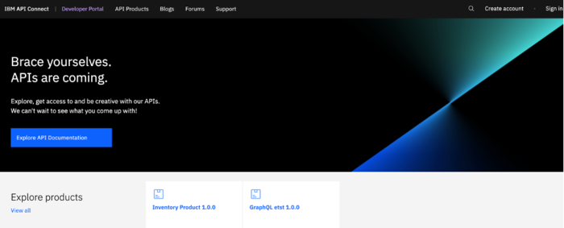

2.  Some products are visible to all users without an account depending
    on the Product visibility setting. Additional options are available
    when you login to the Portal Server.

    Click **Sign in** to login to the portal

3.  Login to portal user using the username and password supplied in the
    email.

    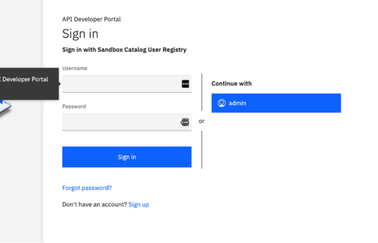

4.  After successful login, you will see a Get Started page. Proceed to
    create a new Test application.

 

 ### Register a test app

API Connect enforces entitlement rules to ensure that consumers are
allowed to access the APIs that are being requested. The instructions
below will guide you through registering your consumer application and
subscribing it to an API Product.

#### Create A New Consumer Application

1.  Click on Apps
    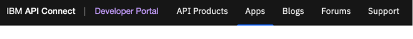

2.  Click  *Create a new App*.

    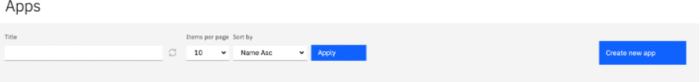

3.  Give your application the title `IBM Consumer Application` and then
    click `save`.

    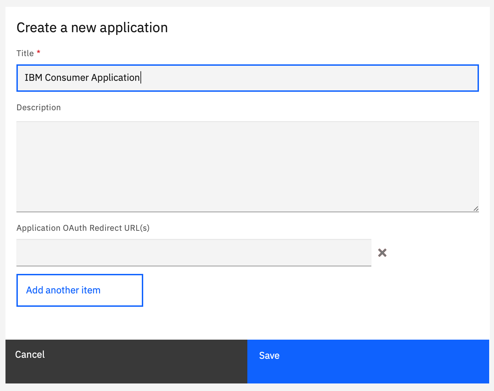

4. When your consumer application is registered in the IBM API Connect
system, it is assigned a unique set of client credentials. These
credentials must be provided on each API request in order for the system
to validate your subscription entitlements. The Client ID can be retireved anytime but the Client Secret can only be retrieved at this time. Copy and save both of these values over to a scratch pad for later reference.

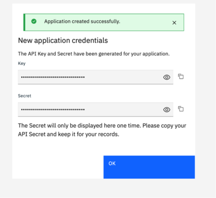

5.  Click the OK

### Subscribe to the API Product

At this point, your registered consumer application has no subscriptions.
In order to grant it access to an API resource, you must subscribe to a
Product and Plan.

1.  Click `API Products` at
    the top of the screen or click on the `Why not browse the available APIs?` link in the Product subscription section of your new Application. 
    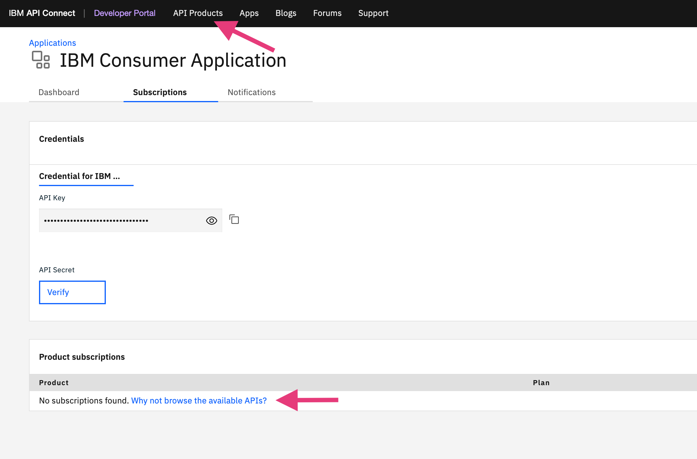

2.  Click the `Branch APIs 1.0.0` product.

    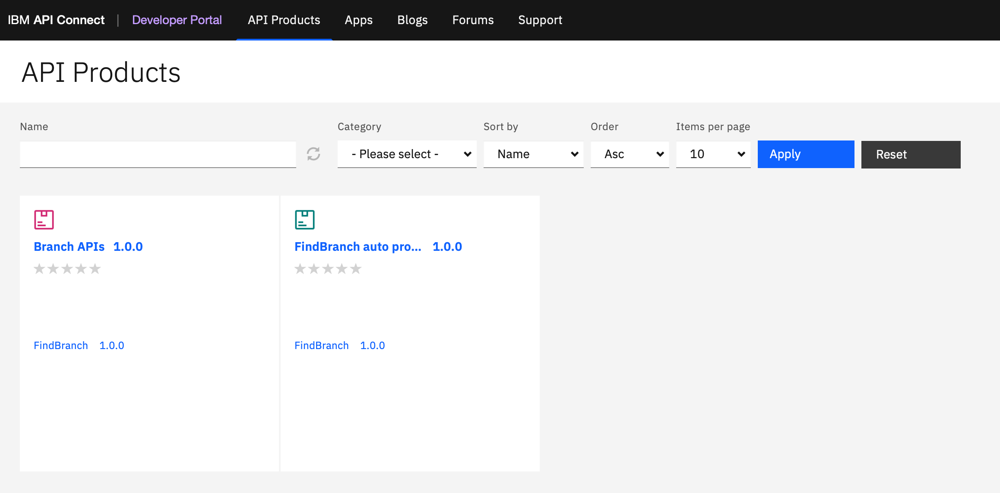

3.  Click on the Blue `Select` Box in the Default Plan. If we had created different plans for the product this is where we would see the options and select which one is correct for our application. 

    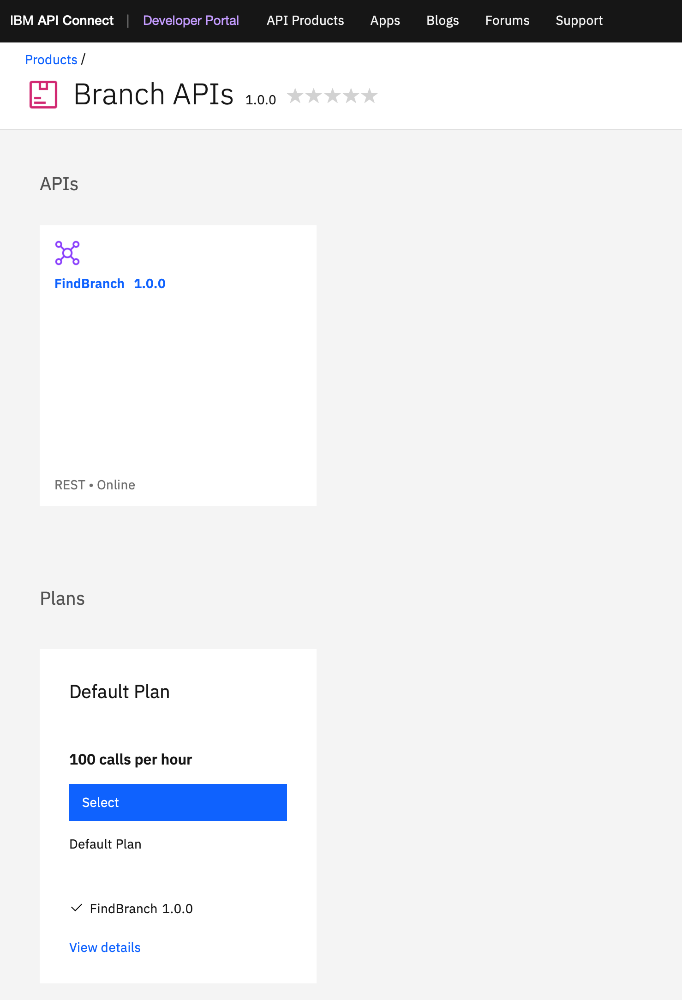

4.  **Select your application**, 
      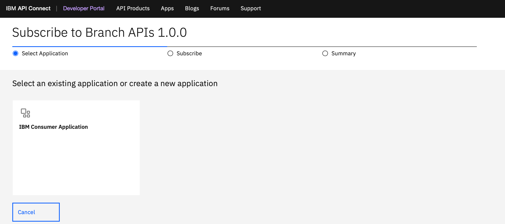

5.  **Confirm Your Subscription**, 
      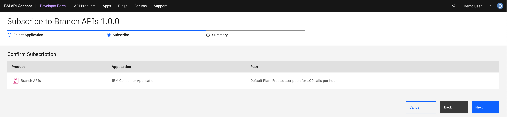
6. Subscription is Complete so Click blue **Done** box.
      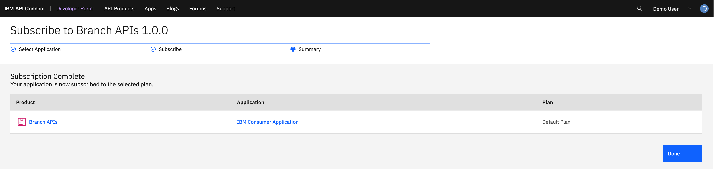

 ## Test the API

The API Connect Developer Portal allows consumers to test the APIs
directly from the website. This feature may be enabled or disabled
per-API.

1.  Click `API Products` at
    the top of the screen.

2.  Click the `Branch APIs 1.0.0` product.

  

3.  Open the **FindBranch 1.0.0** API to browse the API definition.

4.  Click the `GET /details` operation
    on the left palette.

    In the right column, you will find information about the request
    parameters and links to the response schemas.

5.  Click the `Try it` tab. If you only have one application registered, it will be
    automatically selected in the `Client
    ID` drop-down menu. If you have more
    than one, select the application which is subscribed to this API
    Product.

    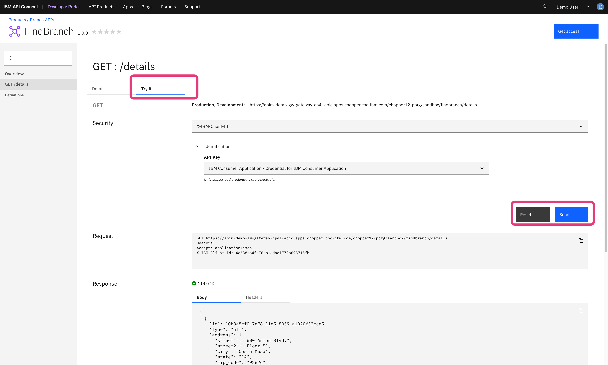

6.  Click the `Send` button
    to invoke the API.

7.  Scroll down to see the call results.

**Note: If running for the first time, you may see Code: 0 No response
received. Causes include a lack of CORS support on the target server,
the server being unavailable, or an untrusted certificate being
encountered. Clicking the link below will open the server in a new tab.
If the browser displays a certificate issue, you may choose to accept it
and return here to test again.**

## Summary

You completed the APIC Dev Jam Lab 2 - The Developer Portal Experience.
Throughout the tutorial, you explored the key takeaways: 

-   Configure Developer Portal and publish the APIs.

-   Create a Portal Account. 

-   Create App and Subscribe to Plan

-   Test API in Developer Portal. 

Continue the APIC Dev Jam! Go to [APIC Dev Jam Lab 3 - The Developer Portal Experience](../Lab3) 
