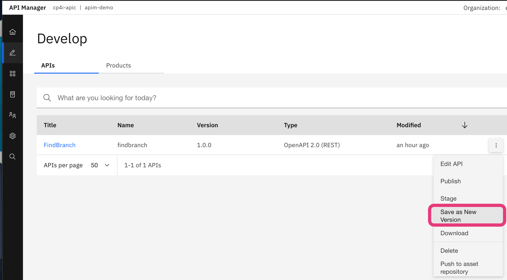

# APIC Dev Jam Lab 3 - Add OAuth Security to your API #

In this lab, you will secure the Inventory API to protect the resources
exposed by **API Connect**. Consumers of your API will be required to
obtain and provide a valid OAuth token before they can invoke the
Inventory API.

In this tutorial, you will explore the following key capabilities:

-   Configure an OAuth 2.0 service, the Resource Owner Password grant
    type.

-   Clone a new version of an API.

-   Secure the new version of your API.

## APIC Dev Jam Series

The APIC Dev Jam Series is a hands-on workshop with lab exercises that
walk you through designing, publishing, and securing APIs. This workshop
is for API developers, architects, and line of business people who want
to create a successful API strategy. There are 8 labs and each is 30
minutes long. Make sure you choose enough time in your reservation to
get through all the labs! 

Prerequisites: Labs 1-2

## Configure a New OAuth 2.0 Provider API

API Connect is a full-featured OAuth 2.0 provider. The OAuth exchange
works like any other API call, and thus we treat it as its own API. In
this section, you will create a new OAuth provider API, configure which
grant type to use, and configure how it will authenticate user
credentials.

### Configure Authentication URL User Registry

In order to configure user authentication, you must first define the
registry to use, which may be LDAP, local user registry, or an
authentication URL. For our lab, we will implement an Authentication
URL.

1.  In the API Manager from the main menu on the left,
    click `Resources` (#1) and `Create` (#2) to create our new registry.

    

2.  Select the `Authentication URL User
    Registry` tile.

    

3.  Specify the only following properties and then
    click `Save`

    Title: `App Registry`

    URL: `https://thinkibm-services.mybluemix.net/auth`

    Display name: `App Registry`

    Click `Save` to save the resource

    

Create OAuth Service
----------------------------------------------------------------------------------------------------------------------------------------

1.  You should still be in the Resources section but if not from the API Manager left menu,
    click `Resources`.

2.  In the Resources menu, click  `OAuth Providers-> Native OAuth
    Provider`.

    

3.  Specify the following properties and
    click `Next` to continue.

    Title: `oauth`

    Name: `oauth`

    Gateway Type: `DataPower API Gateway`

    

4.  The next configuration screen will display the default paths to the Authorize and Token endpoints. For Supported grant types, choose `Resource owner password`. For Supported Client types, choose `Confidential`. Uncheck any of the other grant types and/or public client types if they do get selected.
    Click `Next` continue.

    

5.  One scope is generated for you
    : `sample_scope_1`

6.  Modify the values
    for `sample_scope_1`, set the
    following fields:

    Name: `branch`

    Description: `scope for Branch APIs`

    
    
    Click `Next`.

7.  For the Autenticate application users using `Drop Down` we want it to be `App Registry` which should be the default value. Click `Next`.

8.  Review your OAuth configuration and
    click `Finish`. When the OAuth provider is created you can continue to modify it in the non-Wizard view but make sure to click `Save` after making changes.
    
     
    
 

9. Using the API Management left side navigation, click on `Catalogs` (1) and select the `Sandbox` Catalog (2). 
    
10. Once in the Sandbox Catalog select `Catalog settings` (1) and then the sub-menu will appear to select `API user registries` (2) and then select the blue 'Edit' button (3)
    
    
    
11. Enable available API registry and click save.

    

Add the OAuth Service to the Sandbox Catalog
----------------------------------------------------------------------------------------------------------------------------------------------------------------

1.  On the Sandbox Settings sub-menu, click `OAuth
    Providers` (1) and then click the blue `Edit` box (2).
    

2.  Choose the OAuth service created above. Then click `Save`. 

    

## Create a New Version of the FindBranch API

API Connect supports multiple versions of APIs. Create a new version of the inventory API before making any changes that would break functionality for existing consumers. 

First of all we will save the API as a new version.

1.  In the API Manager from the main menu on the left, click `Develop` (pencil icon).

2.  Click on the menu icon to the right of `FindBranch 1.0.0` API and select `Save as a new version`.  

    

3.  Enter the new version number
    as `2.0.0` and
    click `Submit`.

## Add OAuth security to the Inventory API

Modify the security policy for your new API version to tell it to use your OAuth 2.0 provider.

1.  From the Develop home page, make sure to click `FindBranch 2.0.0` so we don't edit the original API.

2.  Navigate to the `Security Schemas` section.
        

3.  Click on the 

4.  On the API Security Definition screen, enter the following:

    -   Name: `oauth-1`

    -   Description: `API OAuth security definition`

    -   Type: `oauth2`
    -   OAuth Provider (Name): `oauth`

    -   Flow: `Resource Owner`

    -   Token URL: *keep default* `https://$(catalog.url)/oauth/oauth2/token`

    -   Leave everything else to the default values and
        click **Save**.  

        

5.  Navigate to the \`Security\` section and select the existing entry to edit clicking the pencil.
      

6. Then click on `oauth-1` and press `Submit`.

    

6.  Save your changes.
7. Keep Exploring API Connect on your own
	- Building New Products
	-  Modify the Plans (e.g. 3 per minute) to see plan capping
	- Drive some traffic to expore analytics

## Summary

You completed the APIC Dev Jam Lab 3 - Add OAuth Security to your API. Throughout the tutorial, you explored the key takeaways:

-   Configure an OAuth 2.0 service, the Resource Owner Password grant
    type.

-   Clone a new version of an API.

-   Secure the new version of your API.

Continue the APIC Dev Jam! Try some more complex APIs in section 2. 
