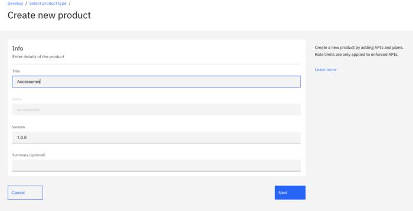
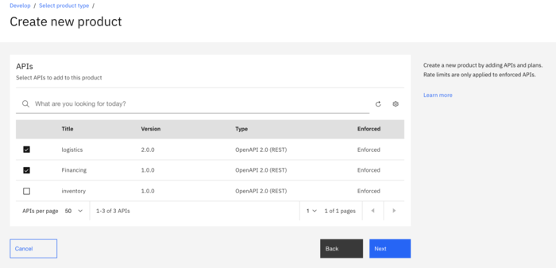
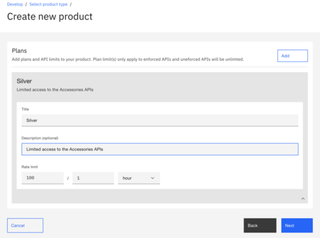
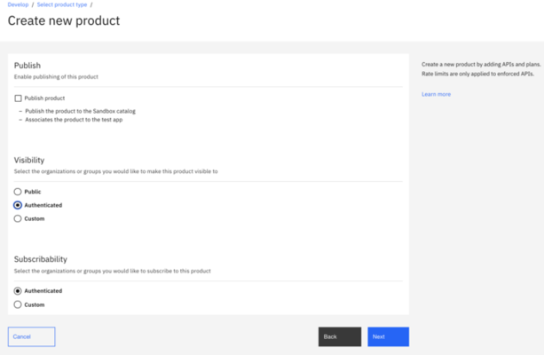
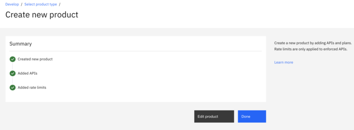
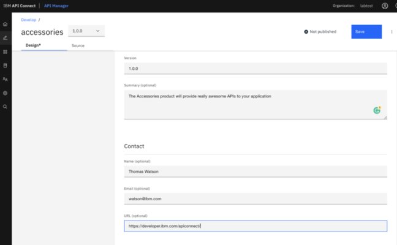
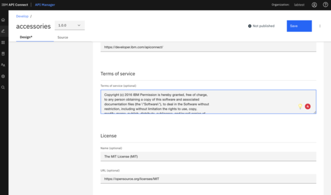
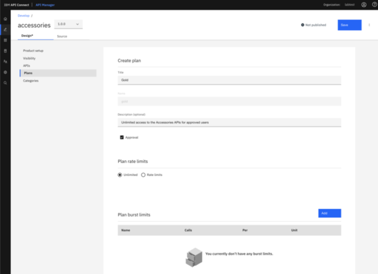
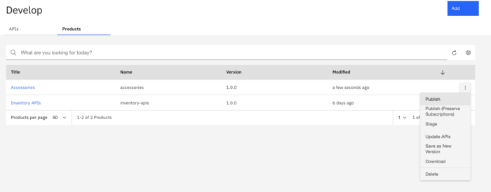
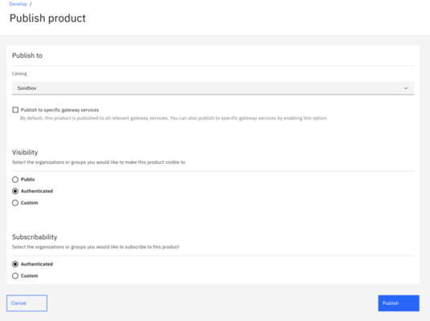

# APIC Dev Jam - Lab 6 - Working with API Products #

Your work as an Application Developer and API Designer is now complete.
It's time to switch roles and become an API Product Manager. The role
of the API Product Manager is to take the developed assets and bundle
them together using a go-to-market strategy.

In this case, you will publish the APIs from the accessories project
together as a bundled product offering to API Consumers. Additionally,
you will create two plans which have different levels of access to your
APIs.

In this tutorial, you will explore the following key capabilities:

-   Create a Product

-   Attach APIs to a Product

-   Create a Plan

-   Publish a Product

## APIC Dev Jam Series

The APIC Dev Jam Series is a hands-on workshop with lab exercises that
walk you through designing, publishing, and securing APIs. This workshop
is for API developers, architects, and line of business people who want
to create a successful API strategy. There are 8 labs and each is 30
minutes long. Make sure you choose enough time in your reservation to
get through all the labs!

Prerequisites: Labs 1-5

## Create an API Product

Before being published, APIs are packaged into Products. In Lab 4, you
saw how to create a new Product. In this section, you will create
another new Product for the accessories APIs, as well as create two new
Plans to which consumers can subscribe.

1.  Click on the Develop tab.

2.  Click `Add. `Select `Product`.

3.  Select `New product`*.*

4.  Provide the following configuration for the new product:

    Title: `Accessories`

    Name: `accessories`

    

5.  Click `Next`.

6.  Select the checkboxes next
    to `financing` and `logistics`.
    Then
    click `Next`.

    

7.  Provide the following Plan details:

    Title: `Silver`

    Description: `Limited access to the Accessories APIs`

    Keep rate limit of 100 with an interval of 1 hour

    

8.  Click `Next`.

9.  Modify the Visibility so that the product is only visible
    to `Authenticated
    users`.
    Then
    click `Next`.

    

10. The product has been created! Click `Edit
    Product` to
    make changes.

    

11. In the Product Setup section, specify the following details:

    Summary: `The Accessories product will provide really awesome APIs to your application.`

```
Contact Name: Thomas Watson

Contact Email: watson@ibm.com

Contact URL: https://developer.ibm.com/apiconnect/

```
 

12. Specify a License and Terms of Service:

    License Name: `The MIT License (MIT)`

    License
    URL: `https://opensource.org/licenses/MIT`

    Terms of Service: *paste the contents of the box below:*
```
`Copyright (c) 2016 IBM Permission is hereby granted, free of charge,
to any person obtaining a copy of this software and associated
documentation files (the \"Software\"), to deal in the Software without
restriction, including without limitation the rights to use, copy,
modify, merge, publish, distribute, sublicense, and/or sell copies of
the Software, and to permit persons to whom the Software is furnished to
do so, subject to the following conditions: The above copyright notice
and this permission notice shall be included in all copies or
substantial portions of the Software. THE SOFTWARE IS PROVIDED \"AS
IS\", WITHOUT WARRANTY OF ANY KIND, EXPRESS OR IMPLIED, INCLUDING BUT
NOT LIMITED TO THE WARRANTIES OF MERCHANTABILITY, FITNESS FOR A
PARTICULAR PURPOSE AND NONINFRINGEMENT. IN NO EVENT SHALL THE AUTHORS OR
COPYRIGHT HOLDERS BE LIABLE FOR ANY CLAIM, DAMAGES OR OTHER LIABILITY,
WHETHER IN AN ACTION OF CONTRACT, TORT OR OTHERWISE, ARISING FROM, OUT
OF OR IN CONNECTION WITH THE SOFTWARE OR THE USE OR OTHER DEALINGS IN
THE
SOFTWARE.`
```


13. click `Save` on the top banner.

14. Navigate to the Plans section. Click the **Add** button to add a new
    plan.

15. Fill in the following details:

    Title: `Gold`

    Description: `Unlimited access to the Accessories APIs for approved
    users`

    Approval: check

    Rate Limits: Click **unlimited** on rate to make this plan unlimited.

    Burst Limits: Delete the default burst-limit.

    

16. **Save** your changes. Then
    click `Develop` in
    the main menu on the left.

## Publish the API Product

Publish the Accessories Product and make it ready for consumers.

1.  On The Develop page, Click on the Product tab, you should see the Accessories-1.0.0 Product in
    the list.  

2.  Click the `3 dot menu
    button` in
    the row for
    Accessories-1.0.0.  

3.  Click `Publish.`

4.  The Sandbox catalog is already selected.
    Click `Publish`.

    

## Summary

Congratulations! You have successfully configured and published a new
product with multiple APIs. Throughout the tutorial, you explored the
key takeaways:

-   Create a product.

-   Attach APIs to a product.

-   Create a plan.

-   Publish a product.

Continue with the APIC Dev Jam! Go
to [APIC Dev Jam - Lab 7 - The Consumer Experience](../Lab7))] to
explore the consumer experience for APIs that have been exposed to your Sandbox catalog.
